# lilicurroad

A Jenkins plugin that will look up a Yum repo's database, and populate a Jenkins parameter dropdown. 

The primary use case for this plugin is the configuration of deployable artifact versions when running Ansible.


### Package 

```bash
mvn hpi:hpi
```


### Run

```bash
mvn hpi:run -Djetty.port=9090 -Pjenkins
```

... or ...

```bash
export MAVEN_OPTS="-Xdebug -Xrunjdwp:transport=dt_socket,server=y,address=5005,suspend=n" 
mvn hpi:run -Djetty.port=9090 -Pjenkins
```


### Build


... then ...

```bash
open http://localhost:9090/jenkins
```


... or ...

[Click Here](http://localhost:9090/jenkins)


### Usage

[http://mirror.cisp.com/CentOS/6/os/i386/](http://mirror.cisp.com/CentOS/6/os/i386/)

#### Step 1 - Configure the global repositories

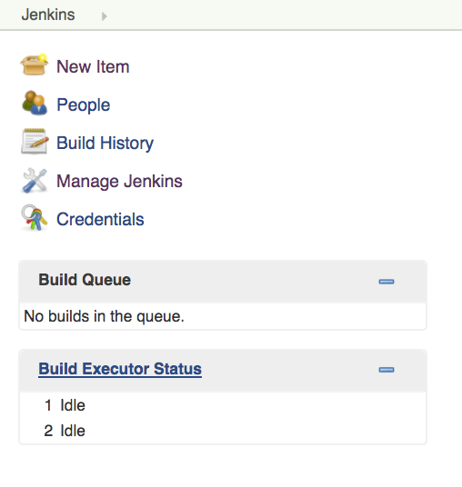
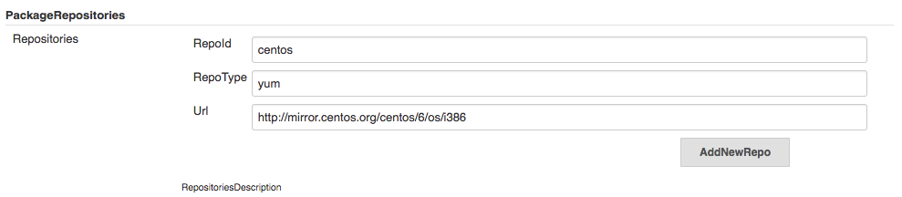

#### Step 2 - Configure the project


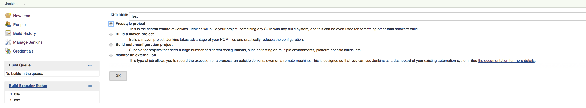
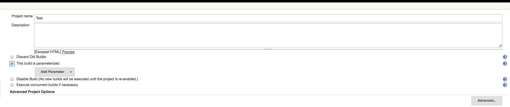
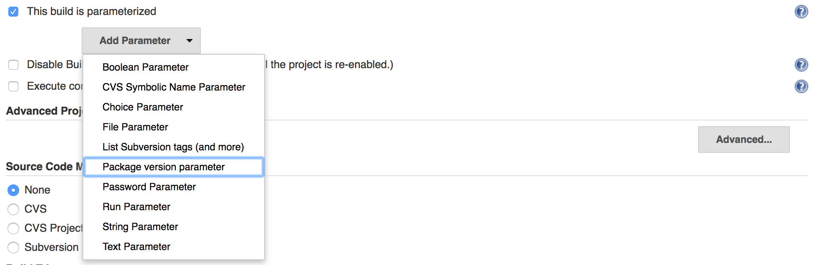
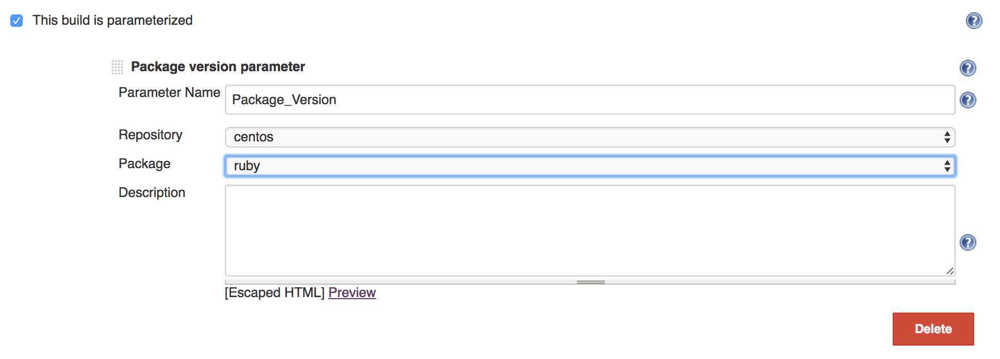
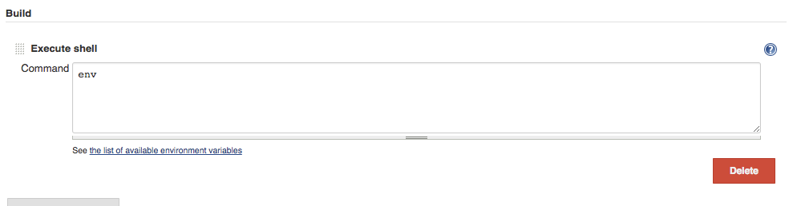

#### Step 3 - Build the project

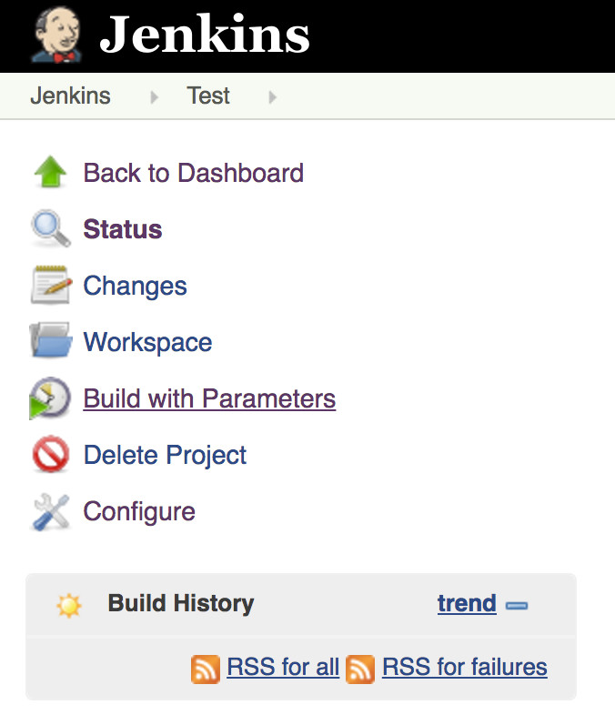
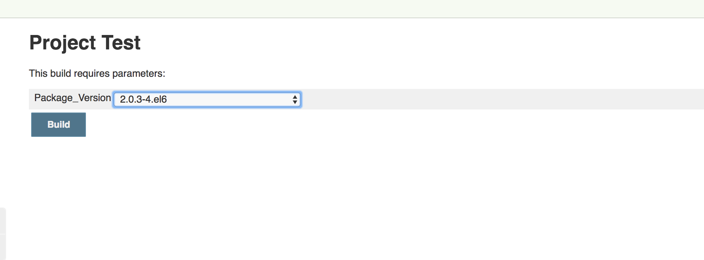

#### Step 4 - Check the project build logs

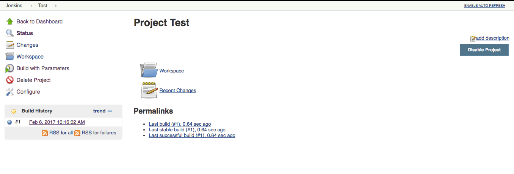
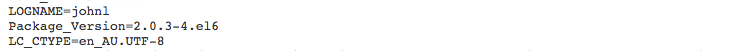

